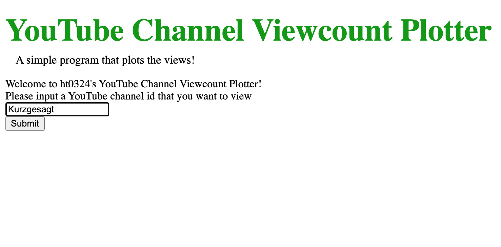

# YouTube-Channel-Viewcount-Plotter

This program takes input from the local server through Local_Server.py and prompts the user to input the username of the YouTube channel to view.

The Local_Server.py will run YouTube-Channel-Viewcount-Plotter.
YouTube-Channel-Viewcount-Plotter will use YouTube API V3 to access upolads playlist and get the individual video data. It will then iterate through the video and get the numbers we want such as viewCount, likeCount, ect.
Finally, maptlotlib will process and plot these numbers.

This is the result!

